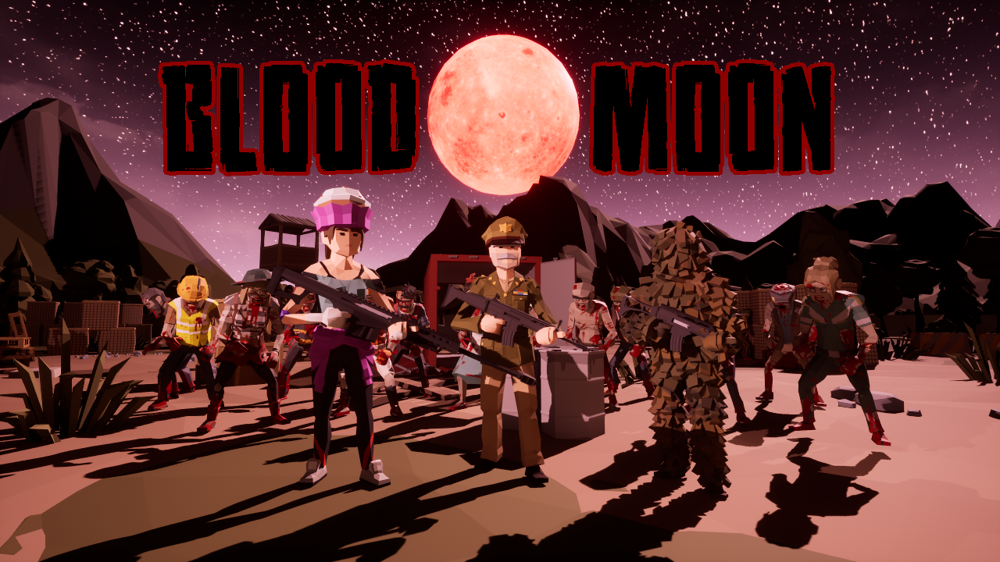
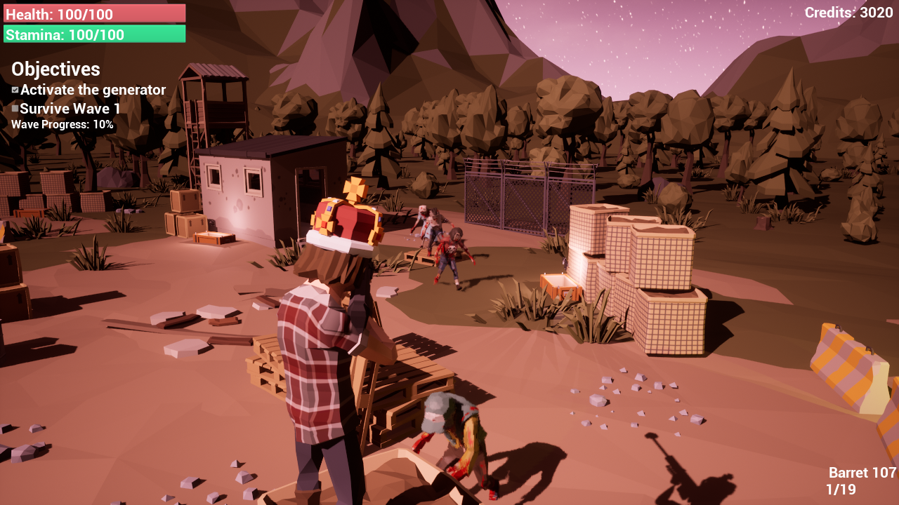
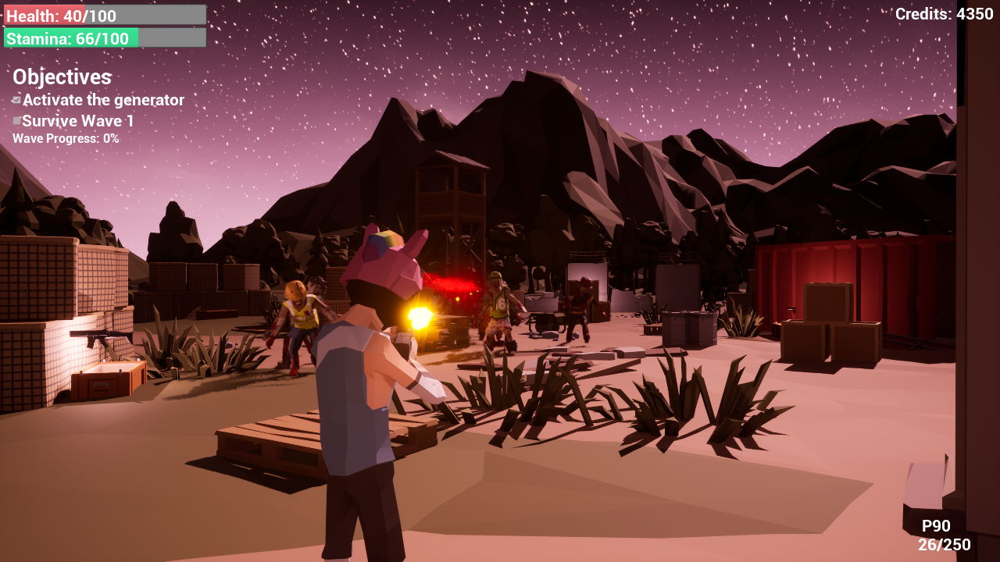

# BloodMoon

A 3rd Person Shooter Zombie Survival game made in Unreal Engine 5. This is my first game developed in the Unreal Engine and my goal with this project was to learn how to use Unreal Engine 5. This project has had all paid assets removed and is not playable.

## Play Now

Game is available to download and play for free on Windows, Mac, and Linux at https://dispixel.itch.io/blood-moon

## Features

### Survival Combat

Fight against infinite waves of increasingly large numbers of zombies. Collect credits from your kills and use them to purchase better weapons to hold off the hoard. Last as long as you can.

### Character Creator

This game features a character creator with dozens of different outfits, hairstyles, facial hairs, and accessories to choose from to allow players to create highly unique characters.

### Weapons

This game includes several different types of weapons to allow for a varity of gunplay and combat, including handguns, assault rifles, smgs and sniper rifles.

## Dependencies
This project depends on the following paid assets:

- [Synty Prototype Pack](https://syntystore.com/products/polygon-prototype-pack?_pos=1&_sid=6df5ca7ed&_ss=r)
- [Synty War Pack](https://syntystore.com/products/polygon-war-pack?_pos=2&_sid=b684e0d8b&_ss=r)
- [Synty Battle Royale Pack](https://syntystore.com/products/polygon-battle-royale-pack?_pos=1&_psq=battle&_ss=e&_v=1.0)
- [Synty City Zombies Pack](https://syntystore.com/products/polygon-city-zombies-pack?_pos=3&_psq=zombie&_ss=e&_v=1.0)
